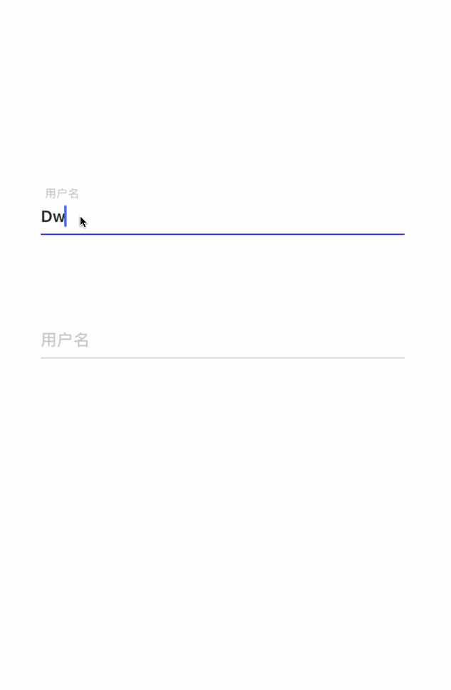

# BMTextField

[](https://travis-ci.org/birdmichael/BMTextField)
[](https://cocoapods.org/pods/BMTextField)
[](https://cocoapods.org/pods/BMTextField)
[](https://cocoapods.org/pods/BMTextField)

## Example

To run the example project, clone the repo, and run `pod install` from the Example directory first.

## 截图



## 说明

```
[textField2 setVerifyText:^BOOL(NSString * _Nonnull text, UILabel * _Nonnull errorLabel) {
        errorLabel.text = @"密码必须大于10位";
        if (text.length >10) {
            return YES;
        }else{
            return NO;
        }
    }];
```

验证可自定义`errorLabel`, 但内部处理好隐藏显示


## 安装

BMTextField is available through [CocoaPods](https://cocoapods.org). To install
it, simply add the following line to your Podfile:

```ruby
pod 'BMTextField'
```


## Author

birdmichael, birdmichael126@gmail.com

## License

BMTextField is available under the MIT license. See the LICENSE file for more info.
